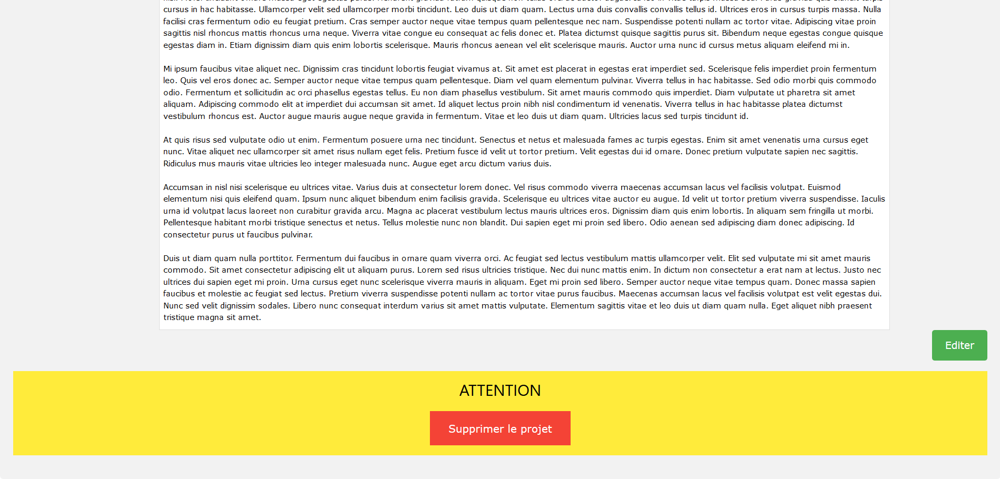

# Portfolio-DUT-Informatique_IUTMetz

Site web de type Portfolio permettant de présenter le DUT Informatique de l'IUT de Metz (bien que le site puisse être utilisé pour d'autres IUT).
Créé à la main sans utilisation de framework avec HTML/CSS, PHP, MySQL et Javascript.

## Fonctionnalités

* Système d'authentification administrateur
* Ajout de nouveaux articles (projets)
* Suppression
* Modification

**Connexion administrateur sur le site (en utilisant la base de données fournie) :**
* Login : admin
* Mot de passe : admin

## Auteurs
* Deewens
* Arthur (https://github.com/Arthur57255)

## Screenshots

**Accueil**

**Ajouter un article**

**Exemple d'un article**

**Connexion administrateur**

**Modification d'un article**
